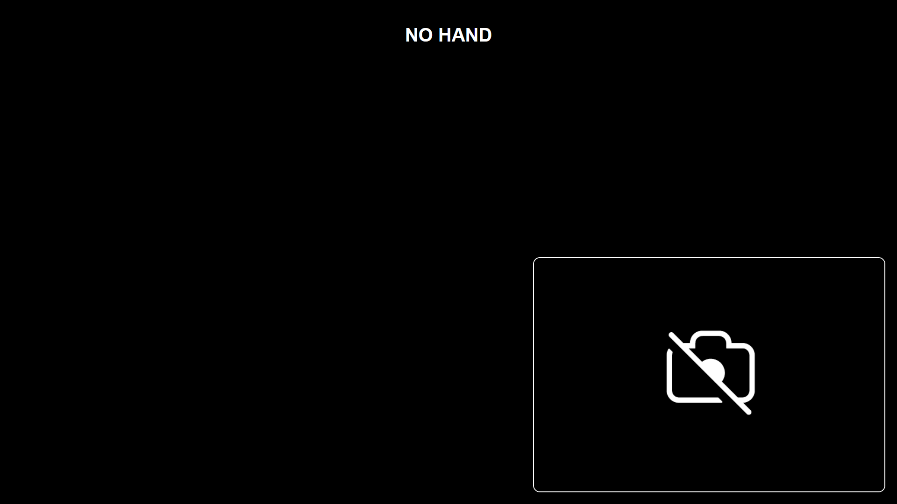
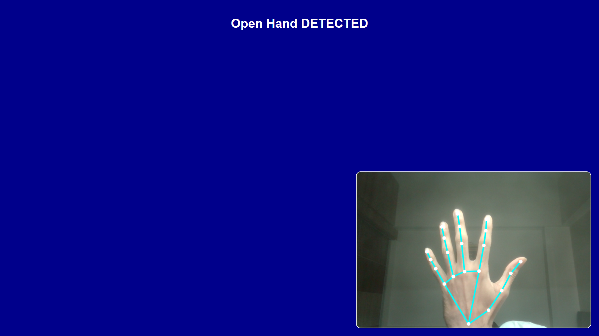
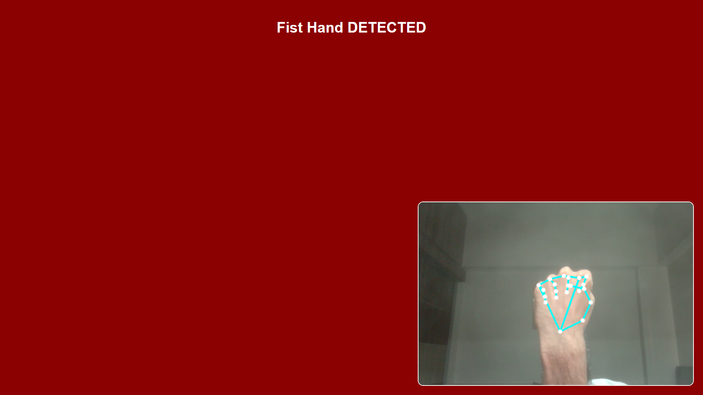

# Hand Gesture Detection

A simple real-time hand gesture detection experiment built using **HTML, CSS, JavaScript, and MediaPipe Hands**.

The project uses webcam input to detect hand landmarks and classify basic hand gestures such as open and closed hands.

---

# ✨ Features

- Real-time hand tracking
- Webcam-based gesture detection
- MediaPipe Hands integration
- Dynamic fullscreen visual feedback
- Hand landmark rendering
- Lightweight frontend implementation
- Responsive canvas rendering

---

# 🧠 Technical Overview

The project uses Google's MediaPipe Hands model to detect and track hand landmarks directly in the browser.

The implementation includes:

- Real-time webcam input
- MediaPipe hand landmark detection
- Canvas-based rendering
- Hand skeleton visualization
- Gesture classification logic
- Dynamic background effects
- Resize-aware fullscreen canvas handling

The application detects the relative distance between the thumb tip and index finger tip to classify simple gestures.

---

# ✋ Gesture Detection Logic

The current implementation supports basic gesture states:

| Gesture | Behavior |
|---|---|
| Open Hand | Changes background color to Blue and status text to Open Hand |
| Closed/Fist Hand | Changes background color to Red and status text to Fist Hand |
| No Hand | Resets the interface state |

Gesture classification is based on landmark distance calculations using MediaPipe hand tracking points.

---

# ⚙️ Technologies Used

| Technology | Usage |
|---|---|
| HTML5 | Structure |
| CSS3 | Styling |
| JavaScript | Logic and rendering |
| MediaPipe Hands | Hand landmark detection |
| Canvas API | Visual rendering |

---

# 🌐 Live Demo

```txt
https://hand-gesture-detection-hh2ooxc4z-herry-projects.vercel.app/
```

---

# 📸 Preview







---

# 📁 Project Structure

```bash
Hand-Gesture-Detection/
│
├── index.html
├── README.md
│
└── Resources/
    ├── img0.png
    ├── img1.png
    └── img2.png
```

---

# 🚀 Run Locally

## Option 1 — Open Directly

Open `index.html` in a browser that supports webcam access.

---

## Option 2 — VS Code Live Server

1. Install the **Live Server** extension
2. Right-click `index.html`
3. Click **Open with Live Server**

---

# ⚠️ Webcam Permission

The browser will request webcam access permission when the project starts.

Hand detection will not function unless camera access is allowed.

---

# 💡 Notes

This project is intended as a lightweight experiment using browser-based hand tracking and simple gesture classification.

The current gesture system is intentionally minimal and can be expanded further with additional gesture recognition logic.

---

# 👨‍💻 Author

### Herry Patel
